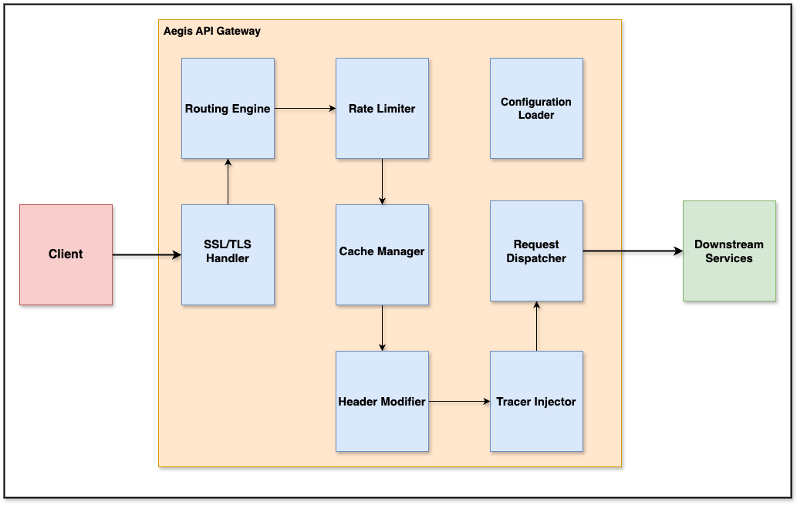

# component-diagram.md

## 🧩 Component Diagram: Aegis API Gateway

This diagram shows the major internal components of the **Aegis API Gateway** and how they interact with external systems.
It focuses on how a request flows through the gateway, and how different responsibilities are separated.

---

## 📐 Component Diagram

 
    

---

## 🔍 Component Responsibilities

### 🔧 Internal

* **SSL/TLS Handler**: Terminates HTTPS connections.
* **Routing Engine**: Routes based on path/header rules.
* **Rate Limiter**: Enforces per-route or per-client rate limits.
* **Cache Manager**: Checks if request is cached, stores responses.
* **Header Modifier**: Adjusts headers as per config (forwarded IP, tracing, etc).
* **Tracer Injector**: Adds distributed tracing metadata.
* **Request Dispatcher**: Sends request downstream with retries / pooling.
* **Configuration Loader**: Loads YAML and updates running config on changes.
* **Observability Agent**: Pushes logs, metrics, traces to external tools.

### 🌐 External

* **Clients**: Send HTTPS requests.
* **Downstream Services**: Microservices or external APIs.
* **Observability Stack**: ELK, Prometheus, Grafana, Jaeger.
* **YAML Config**: Holds routing, SSL, caching, rate limits.
