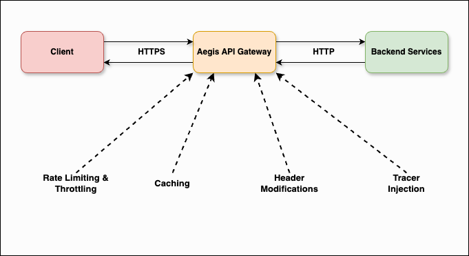
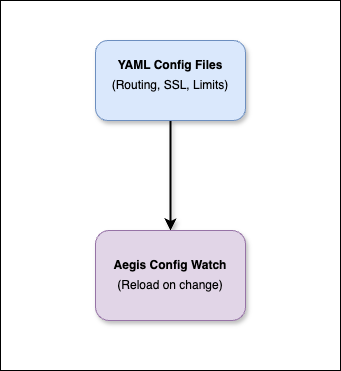

# high-level-diagram.md

## 📈 High-Level Architecture Diagram for Aegis API Gateway

This document illustrates the **high-level architecture** of the Aegis API Gateway MVP, detailing the main components and how they interact in the production environment.

---

## 🚀 Components Overview

* **Client**: Any HTTP client (browser, mobile app, other services) sending requests.
* **Aegis API Gateway**:

  * Handles routing, SSL/TLS termination, rate limiting, caching, header manipulation, and tracing injection.
  * Configured via YAML.
* **Service Registry / Config**:

  * Holds route definitions, policies, and other dynamic configurations.
* **Backend Services**:

  * The actual microservices or APIs that process the business logic.
* **Observability Stack**:

  * Logs, metrics, tracing systems (e.g., Prometheus, Grafana, Jaeger).

---

## 📝 High-Level Flow

 
    

---

## 🔍 Supporting Systems

 
    

---

## ✅ Key Interactions

* **SSL Termination** happens at the Gateway, offloading HTTPS from backend services.
* **Routing** uses path or header-based rules defined in YAML.
* **Rate Limiting & Throttling** protect downstream services.
* **Caching** avoids unnecessary hits to backends for frequently accessed data.
* **Header Modification & Tracing** ensure observability and metadata propagation.

---

## 🗂 Diagram Notes

* Designed to be **cloud native**, easily deployable on **AWS EKS**.
* Integrates with external tracing & logging systems.
* Future enhancements can include auth, circuit breaking, retries.

